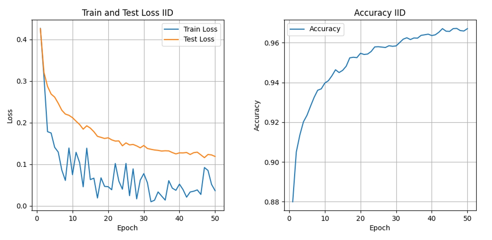
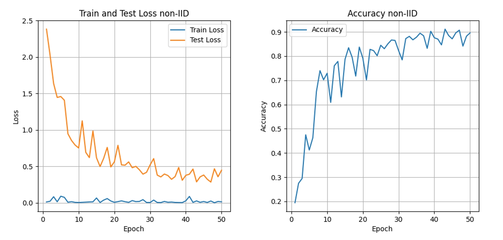

# Federated Learning

## Introduction

This repository contains a reading report of the paper: [Communication-Efficient Learning of Deep Networks from Decentralized Data](https://arxiv.org/abs/1602.05629), along with coresponding implementation. 

You can view the report here: [report](report.md). 

The implementation is developed by using PyTorch and currently supports training on the MNIST dataset with `2NN` model as described in the paper. It covers both I.I.D. and non-I.I.D. cases. Additionally, the implementation includes visualization capabilities to show losses and accuracy changes. 

## Usage

#### Model Training

Simple run by: `python main.py`, or run by: `python main.py --parameter=value` to customize the parameters. The training results will be stored in `results_{data_time}.pkl` in the current directory. 

All parameter settings are defined in `settings.py`, and its details are as follows(notation follows the paper):

- `--rounds`: Number of communication rounds (default: 50).
- `--E`: Number of local epochs (default: 10).
- `--B`: Local minibatch size (default: 10).
- `--K`: Number of clients (constant value: 100). (**Fixed**)
- `--C`: Fraction of clients that perform computation on each round (default: 0.1).
- `--lr`: Learning rate (default: 0.01).
- `--if_iid`: Whether the training set will be I.I.D. (default: True).
- `--device`: Device to conduct training on, either "cuda" or "cpu" (default: "cpu").

#### Results Visualization

Run by: `python visualizaiton.py --file_name="{pickle file name}"`. 

This command generates visualizations for train and test loss, as well as accuracy, based on the specified pickle file.

## Current Results

Parameter settings for the experiments are as follows:

| Parameter | Value |
| --------- | ----- |
| E         | 10    |
| B         | 10    |
| C         | 0.1   |
| lr        | 0.01  |

Using the above settings, the experiment results for the I.I.D. case and the non-I.I.D. case are shown in the figures below:

 

In the I.I.D. case, the accuracy rapidly increases from 88% to over 90%, eventually reaching nearly **97%** by the 50th round.

 

In the non-I.I.D. case, the accuracy starts at less than 20% and climbs to a peak of **90%** after 50 rounds.